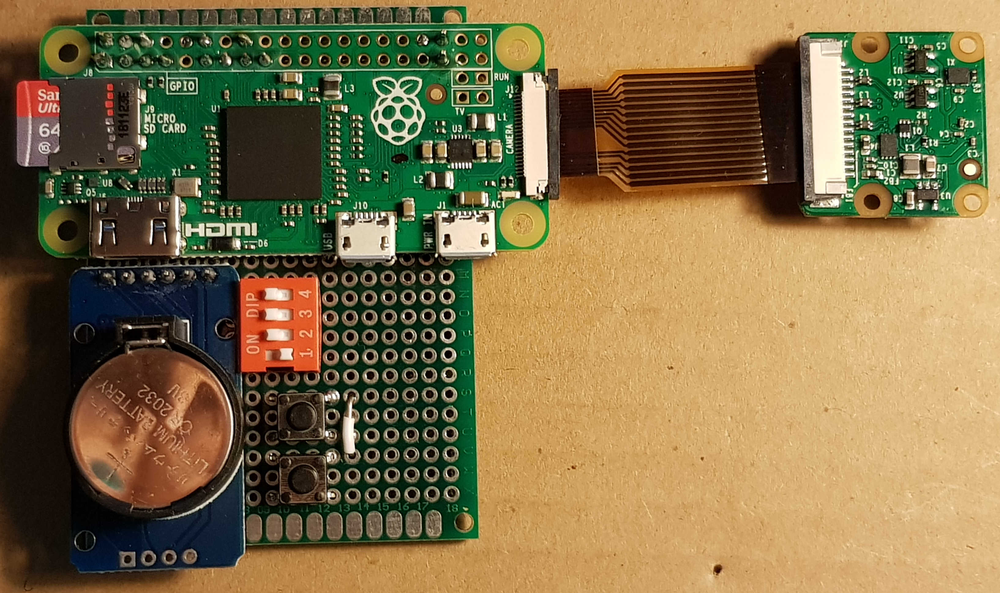

# RPi_Cam
Raspberry Pi Zero Camera with motion detection based on the set-up and code available at [hackster.io](https://www.hackster.io/team-ppi/variable-time-camera-for-monitoring-plant-pollination-events-ad21e7) by Roman Kellenberger

## Special features
* take pictures or videos in a certain intverval, or
* take pictures or videos triggered by motion
* adjustable sensitivity of motion detection
* suspend taking pictures/videos during night hours to save energy
* programmable shutdown at a certain time
* hardware-switch to change between pictures-videos, motion detection on-off, timestamp on-off, test mode-camera align mode-normal mode
* buttons for rebooting or shutting down the pi
* real-time clock to keep the time 
* align the camera with a smartphone via live image
* download the pictures/videos and manage file system with a smartphone

## Parts
* Raspberry Pi Zero 
* micro SD card (64GB)
* Pi Zero Camera (or Pi Camera + flex cable adapter)
* RTC DS3231 Module
* 4 pin DIP sliding switch
* 2 x buttons
* Case (Bopla T231)
* micro USB to USB adapter cable
* USB WIFI adapter
* Android smartphone (should also work with iOS)
* Power bank (10Ah)

## Setup
1. solder/connect the RTC, switch and buttons to the RPi
 * RTC
    - GND --> GND
    - VCC --> 5V
    - SDA --> Pin 3
    - SCL --> Pin 5
 * buttons
    - Power off button: 3.3V and Pin 15
    - Reboot button: 3.3V and Pin 16
 * switch
    - off --> 3.3V
    - 1   --> Pin 13 (OFF: picture mode, ON: video mode)
    - 2   --> Pin 12 (OFF: no timestamp, ON: timestamp)
    - 3   --> Pin 11 (OFF: intervall mode, ON: motion detection mode)
    - 4   --> Pin 7  (OFF: normal mode, ON: test mode)
2. flash sd card with raspbian image
3. create ssh and wpa_supplicant.conf files in boot partition to be able to connect to the pi over wifi
4. connect the USB WIFI adapter to the RPi, boot the RPi and connect via ssh (ssh pi@192.123.456.78)
5. enable camera, vnc and i2c, and set timezone (sudo raspi-config)
6. set up the rtc (https://pimylifeup.com/raspberry-pi-rtc/ or https://www.raspberrypi-spy.co.uk/2015/05/adding-a-ds3231-real-time-clock-to-the-raspberry-pi/)
7. install imagemagick (sudo apt-get install imagemagick)
8. add the python files from this repository to /home/pi/Camera/ and "settings.txt" to /home/pi/Desktop/
9. add the lines:
  * python3 /home/pi/Camera/camera_button_off.py &
  * python3 /home/pi/Camera/camera_button_rebo.py &
  * python3 /home/pi/Camera/script_ini.py &

    to /etc/rc.local (sudo nano /etc/rc.local)
10. install "VNC Viewer" and "Total Commander" to your smartphone
11. add the "SFTP" plugin to the "Total Commander" app
12. create a WIFI hotspot with a smartphone and add the network information to wpa_supplicant.conf
13. connect to your RPi via the "VNC Viewer" app, open the VNC Server dialog, navigate to Menu > Option > Troubleshooting and enable direct capture mode

## Field Application
### set camera settings
1. connect USB WIFI adapter to the RPi and create a WIFI hotspot with your smartphone
2. set switch #4 to ON (test mode, make shure that switch #1 is set to OFF)
3. boot the RPi and connect to it via "VNC Viewer" on your smartphone (may take some time until the RPi is booted and WIFI enabled)
4. open the file "settings.txt" on the RPi's Desktop and adjust settings
### align the camera
1. set the switch #1 to ON (video mode), leave switch #4 in test mode
2. reboot the RPi either by navigating to the shutdown button on the Desktop via VNC or simply push the hardware reboot button
3. reconnect "VNC Viewer" to the RPi
4. align the camera by checking the live camera view on your smartphone
5. set the switch #4 to OFF (normal mode) and push the reboot button
### check the camera and manage file system
1. after the RPi has rebooted, start the "Total Commander" app on your smartphone and connect via SFTP
2. navigate to /home/pi/Camera/ and check if new files are already created in the BOOT folder
3. using the "Total Commander" app you can also download the files to your smartphone
4. disconnect, unplug the USB WIFI adapter and let the camera do its jop

## Notes
* if USB WIFI adapter is reconnected while the RPi active, the RPi might reboot. In order to avoid sd memory corruption, press the shutdown button, connect the USB WIFI adapter and reconnect the RPi to the power supply
* a Raspberry Pi Zero W with integrated WIFI controller could be used if the camera will be placed in a lab or somewhere with constant WIFI and power supply. So you can also connect to your RPi over vnc or ssh from all around the world

